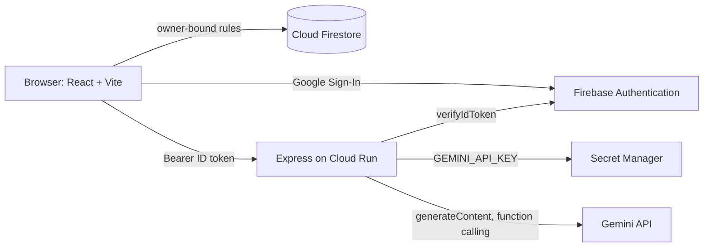

# Gemini Me

"How can AI help me?" is the question everyone asks and nobody answers. Gemini Me answers it by not asking you to know. You write about your day, in plain words, and Mini-Me works out where it can help.

Built with Google AI Studio, Gemini, Firebase Authentication, Cloud Firestore, Secret Manager and Cloud Run for the Google Cloud GenAI Academy ideathon (#AccelerateAIwithCloudRun).

## What it does

- **Daily journal.** One entry per day, written as a conversation. Mini-Me (Gemini) reflects back what it heard and asks at most two short follow-up questions. Warm or direct tone, your choice.
- **Boards.** Seven life boards: Work, Family, Friends, Health, Money, Leisure, Goals. After you write, Gemini extracts notes (task, idea, plan, habit, win, worry, fact), scores your mood for the day, and files each note on one or more boards. A note can live on several boards at once.
- **Human in the loop.** Extraction never writes to your boards directly. It writes a proposal. You review it, edit it, toggle boards, then approve or discard. Nothing reaches a board without your say.
- **Ask Mini-Me.** A coach that answers questions about your own entries and boards using server-side tools: search entries, list notes, inspect a board. It only states what the tools return.
- **History and mood.** Every day keeps its conversation, a one-line summary, and a mood score from 1 to 5.

## Architecture



- The browser talks to Firestore directly under owner-bound security rules.
- Every AI call goes through the Express server on Cloud Run. The server verifies the Firebase ID token with `firebase-admin` before doing anything, and returns 401 otherwise.
- The Gemini API key is read from Secret Manager as an environment variable on Cloud Run. It never reaches the browser.
- A model fallback ladder (`gemini-3.6-flash` then `gemini-3.1-flash-lite` then `gemini-flash-latest` then `gemini-3.7-flash`) handles 429 and 503 with per-model cooldowns.

## Data model

All data lives under `users/{uid}`.

| Path | Fields |
| --- | --- |
| `users/{uid}` | displayName, email, role (`user`, immutable by the user), coachTone (`warm` or `blunt`), createdAt |
| `users/{uid}/entries/{YYYY-MM-DD}` | messages[] (role, text, ts), summary, mood {score, label}, lastExtractedMessageIndex |
| `users/{uid}/boards/{boardId}` | name, description, createdAt |
| `users/{uid}/notes/{noteId}` | text, type, boards[], status (`open`, `done`, `dropped`), dueDate, sourceEntryId, sourceQuote, createdAt, updatedAt |
| `users/{uid}/proposals/{proposalId}` | entryDate, mood, proposedNotes[], suggestedNewBoard, status (`pending`, `applied`, `discarded`), expiresAt |
| `users/{uid}/coachSessions/{sessionId}` | messages[] |

## Security

**Authentication.** Google Sign-In only, through Firebase Authentication. There is no email or password form.

**Server-side token verification.** `/api/chat`, `/api/summarize`, `/api/extract` and `/api/coach` all call `getAuth().verifyIdToken()` from `firebase-admin` and stop with `401 Sign in required.` if the token is missing or invalid. There is no anonymous fallback. The user id used by every route comes from the verified token, never from the request body.

**Firestore rules.** See `firestore.rules`. Every read and write under `users/{userId}` requires `request.auth.uid == userId`. Unspecified paths are denied. The `role` field cannot be changed by the user.

**Secrets.** `GEMINI_API_KEY` lives in Secret Manager and is exposed to the Cloud Run service as an environment variable. Nothing is hardcoded; `.env.example` contains placeholders only.

```bash
# create the secret
echo -n "YOUR_KEY" | gcloud secrets create GEMINI_API_KEY --data-file=- --replication-policy=automatic

# let the Cloud Run service account read it
gcloud secrets add-iam-policy-binding GEMINI_API_KEY \
  --member="serviceAccount:PROJECT_NUMBER-compute@developer.gserviceaccount.com" \
  --role="roles/secretmanager.secretAccessor"

# reference it from the service
gcloud run services update gemini-me --region asia-southeast1 \
  --update-secrets=GEMINI_API_KEY=GEMINI_API_KEY:latest
```

**Browser API key.** The Firebase web config key in `firebase-applet-config.json` is public by design; it identifies the project and grants nothing on its own. It is restricted in Cloud Console by HTTP referrer (the deployed domains only) and by API (Identity Toolkit, Token Service, Cloud Firestore).

**Structured output.** Extraction asks Gemini for JSON with `responseMimeType: application/json` and an explicit `responseSchema`. The server then validates every field against allowlists (note types, boards, status, ISO dates), clamps the mood score, strips unknown fields, and retries once with the validation error if the output is malformed. Nothing unvalidated is written anywhere.

**Human in the loop.** AI output is stored as a proposal with status `pending`. Only an authenticated user action turns it into notes. The coach is read-only.

**Prompt injection.** User text is wrapped in delimiters and the system prompts instruct the model to treat it as writing, not instructions. Tool results carry the same notice.

## Custom instructions used in Google AI Studio

The official production directives from the challenge codelab were extended with five directives that shaped every generation step:

1. **Structured Extraction Standard.** JSON with a response schema, server-side validation, one retry, never persist unvalidated model output.
2. **Human-in-the-Loop Write Policy.** AI writes proposals only; users apply them.
3. **Semantic Memory Standard.** Any retrieval over the user's own entries stays scoped to `users/{uid}` and is injected as data with a delimiter.
4. **RBAC Standard.** `role` on the profile is immutable by the user; admin routes would verify the token server-side and read aggregates only.
5. **Product Voice.** Mini-Me is warm by default, direct on request, second person, no emoji, no em dashes.

## Deploy

1. Publish from Google AI Studio to Cloud Run.
2. Add the challenge label:
   ```bash
   gcloud run services update gemini-me --region asia-southeast1 \
     --update-labels dev-tutorial=cloud-run-ai-challenge
   ```
3. Create the secret and reference it (commands above). Remove any plain `GEMINI_API_KEY` environment variable.
4. Restrict the browser API key to the deployed domain.

## Local development

```bash
bun install
cp .env.example .env   # add your Gemini API key
bun run dev
```

The dev server runs on port 3000. Token verification uses `firebase-admin` with application default credentials.

## Testing

See [TESTING.md](TESTING.md).